# 타입스크립트 개론

> 이정환 강사님의 **'한 입 크기로 잘라먹는 타입스크립트'** 강의를 바탕으로 정리했습니다.

## 타입스크립트란?

### 타입스크립트의 창시자

-   `Typescript`는 2012년에 마이크로소프트의 개발자이자 C#의 창시자인 앤더스 하일스버그에 의해 탄생했습니다.

### 오픈소스 언어로서의 타입스크립트

-   오픈소스로 공개되어 많은 개발자가 개발과 유지보수에 참여하고 있습니다.
-   발전 가능성이 매우 높은 언어입니다.

### 자바스크립트 개발자와 타입스크립트

타입스크립트는 자바스크립트 개발자들 사이에서도 유명한 언어입니다.

-   자바스크립트 개발자 100명 중 89명이 타입스크립트를 사용 중입니다.
-   채용 공고의 자격 요건이나 우대사항에도 자주 등장합니다.

## 자바스크립트와 타입스크립트의 관계

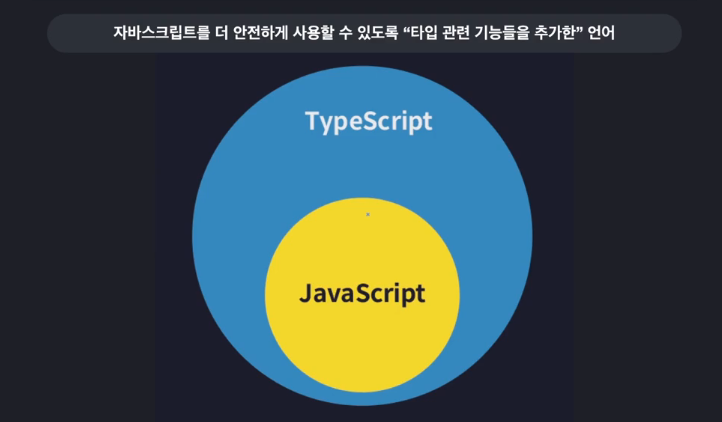

-   타입스크립트는 자바스크립트에 타입 시스템을 추가한 확장 언어입니다.
-   자바스크립트의 기본 문법을 모두 사용할 수 있습니다.
-   타입을 명시적으로 지정함으로써써 코드의 안정성과 유지보수성을 향상시킬 수 있습니다.

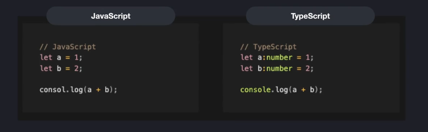

-   자바스크립트에서는 변수의 타입을 프로그래머가 직접 정의할 수 없습니다.
-   타입스크립트 코드에서는 변수에 타입을 지정할 수 있습니다.
    -   타입스크립트 코드의 경우 `a`와 `b`에 Number라는 타입을 지정했기 때문에 숫자 이외의 값은 저장할 수 없습니다.

## 왜 타입스크립트를 배워야 할까?🤔


자바스크립트는 웹 브라우저 안에서만 동작하도록 만들어졌고 원래 아주 간단한 사용자 상호작용을 처리하기 위해 개발된 언어였습니다.

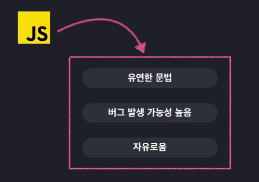

따라서 엄격한 문법을 가질 필요가 없었습니다.

그러나 Node.js의 등장 이후 다양한 환경에서 사용되고 있습니다.

-   자유롭고 유연한 문법 덕분에 빠른 개발이 가능하지만, 그만큼 버그 발생 가능성도 높아졌습니다.
-   타입스크립트는 이러한 문제를 보완하고자 개발되었기 때문에 타입스크립트를 사용하면 더 안전하고 견고한 코드를 작성할 수 있습니다.

## 자바스크립트의 한계점과 타입스크립트

### 타입 시스템이란?


모든 프로그래밍 언어는 타입 시스템을 가지고 있습니다. 타입 시스템은 프로그래밍 언어에서 변수, 표현식, 함수 등이 처리할 수 있는 값의 종류와 이들 간의 상호작용 규칙을 정의하는 체계입니다. 타입 시스템은 프로그램의 안정성, 가독성, 유지보수성에 직접적인 영향을 미칩니다.

### 타입 시스템의 분류: 정적 타입 vs 동적 타입

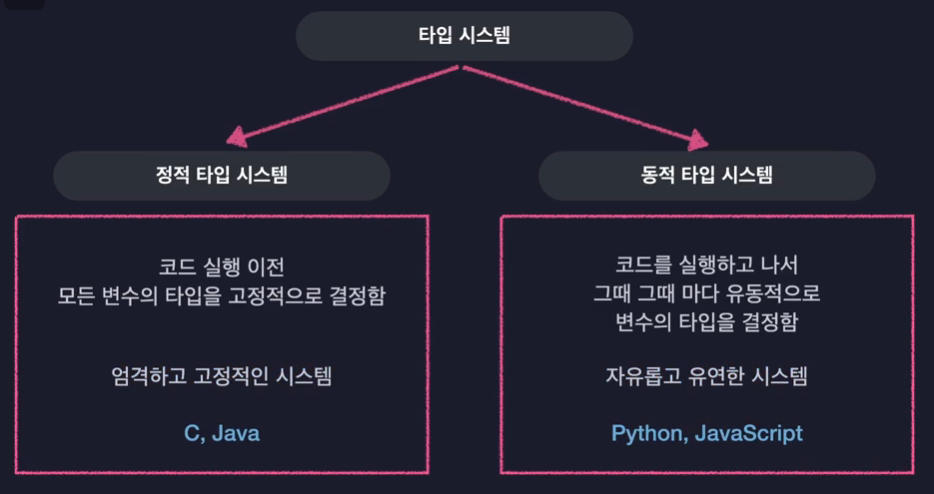

타입 시스템은 크게 정적 타입 시스템과 동적 타입 시스템으로 나뉩니다.

-   **정적 타입 시스템**: 변수의 타입을 코드 작성 시 명확하게 지정하고, 컴파일 시점에 타입 검사를 수행합니다. 대표적으로 `C`, `Java`, `Swift` 등이 여기에 속합니다. 이 방식은 타입 관련 오류를 사전에 발견할 수 있어 안정성이 높고, 실행 성능이 우수한 경우가 많습니다.

-   **동적 타입 시스템**: 변수의 타입이 코드 실행(런타임) 도중에 결정됩니다. `자바스크립트`, `파이썬`, `루비` 등이 대표적입니다. 변수에 어떤 값이든 자유롭게 할당할 수 있고, 타입 선언이 필요 없어 개발 속도가 빠르며, 유연성이 높습니다.

```javascript
let a = 'hello'; //문자열
a = 19970107; //숫자
```

위 코드처럼 자바스크립트에서는 한 변수에 다양한 타입의 값을 자유롭게 저장할 수 있습니다.

### 동적 타입 시스템의 한계

동적 타입 시스템의 유연성은 개발을 빠르고 편하게 해주지만, 예상치 못한 타입 에러가 런타임에 발생할 수 있다는 단점이 있습니다. 예를 들어, 아래와 같은 코드는 실행 도중 `TypeError`를 발생시키며 프로그램이 비정상적으로 종료됩니다.

```javascript
let a = 'hello'; //문자열
a = 19970107; //숫자

a.toUpperCase();
```

이처럼, 코드가 실행되기 전(런타임 전)에는 타입 오류를 발견할 수 없어, 복잡한 프로젝트에서는 버그 추적이 어렵고, 안정성이 떨어질 수 있습니다.

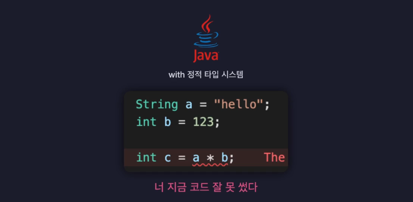

반면, 정적 타입 언어에서는 컴파일 시점에 타입 오류를 미리 발견할 수 있어, 코드의 안정성이 높아집니다. 예를 들어, `Java`에서는 잘못된 타입의 값이 변수에 할당되면 에디터에서 즉시 오류를 표시해줍니다. 하지만 모든 변수에 일일이 타입을 정의하기 때문에 매우 번거롭고 직접 작성해야 되는 코드의 양이 상당히 많아진다는 단점이 있습니다.

### 타입스크립트의 타입 시스템: 점진적 타입 시스템

타입스크립트는 자바스크립트의 동적 타입 시스템과 Java/C 계열의 정적 타입 시스템의 장점을 결합한 **점진적 타입 시스템(Gradual Typing)**을 채택하고 있습니다.

-   타입을 명시적으로 지정한 변수는 컴파일 단계에서 타입 검사를 통해 안정성을 확보합니다.
-   타입을 명시하지 않은 변수는 타입스크립트가 타입을 추론하며, 필요에 따라 타입을 점진적으로 추가할 수 있습니다.

> 이 방식은 개발자가 원하는 만큼만 타입을 엄격하게 관리할 수 있게 해주며, 기존 자바스크립트 코드와의 호환성도 뛰어납니다. 즉, 코드의 안정성과 개발 편의성, 두 마리 토끼를 모두 잡을 수 있는 타입 시스템입니다.

### 요약


-   자바스크립트는 동적 타입 시스템을 사용하여 개발이 빠르고 유연하지만, 타입 오류가 런타임에 발생할 수 있어 대규모 프로젝트에서 안정성이 떨어집니다.
-   타입스크립트는 정적 타입 시스템의 안정성과 동적 타입 시스템의 유연함을 모두 제공하는 점진적 타입 시스템을 채택해, 개발자가 필요에 따라 타입을 추가할 수 있습니다.
-   타입스크립트는 자바스크립트의 한계를 극복함으로써 더 안전하고 견고한 코드를 작성할 수 있게 해줍니다.

## 대다수 프로그래밍 언어의 동작 원리

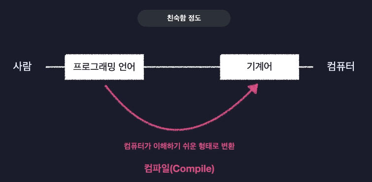

대부분의 프로그래밍 언어는 개발자가 이해하기 쉬운 고급 문법으로 코드를 작성하도록 설계되어 있습니다. 하지만 컴퓨터는 이러한 코드를 직접 이해하지 못하기 때문에, 실행 전에 반드시 컴퓨터가 이해할 수 있는 저수준 언어(기계어 또는 바이트코드)로 변환하는 **컴파일** 과정을 거칩니다.

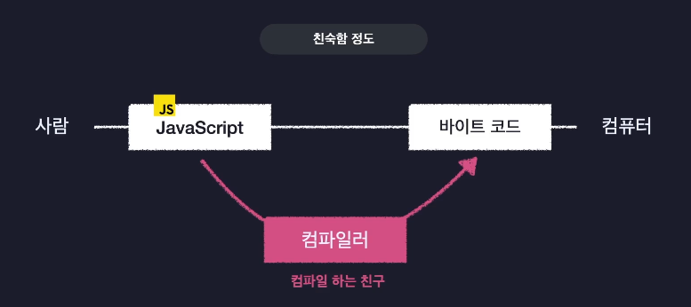

이 변환 작업을 담당하는 프로그램이 바로 **컴파일러**입니다.

`JS`코드도 컴파일러를 거쳐서 `바이트 코드`로 변환되게 됩니다.

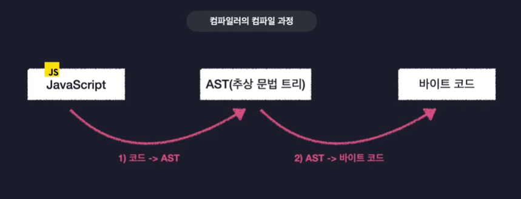
컴파일러는 바이트 코드를 의미 있는 단위인 토큰으로 분리하고, 토큰을 바탕으로 코드 구조를 분석하여 추상 구문 트리(AST)를 생성합니다.

그 다음에 AST를 바탕으로 기계어 또는 바이트 코드로 변환합니다.

이 과정을 거쳐 생성된 바이트 코드는 컴퓨터에서 실행됩니다.

## 타입스크립트의 동작 원리

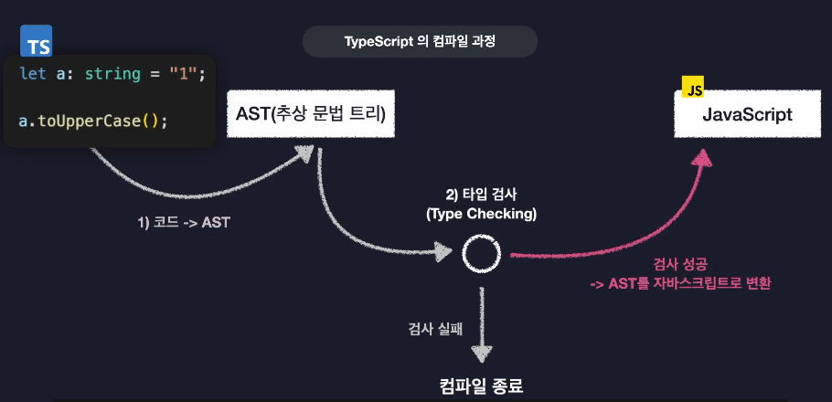

타입스크립트는 전통적인 컴파일 언어와 달리, AST(추상 구문 트리) 단계에서 타입 검사를 먼저 수행합니다.

타입 검사에 실패하면 컴파일이 중단되고, 성공하면 AST를 `자바스크립트 코드`로 변환합니다.

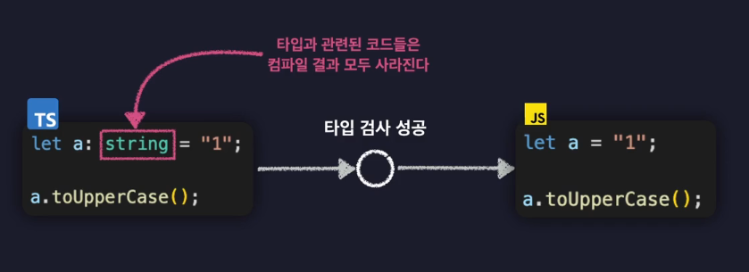

타입스크립트에서 지정한 타입 정보는 컴파일 후 자바스크립트로 변환될 때 모두 제거되고 순수한 자바스크립트 코드만 남게 됩니다.

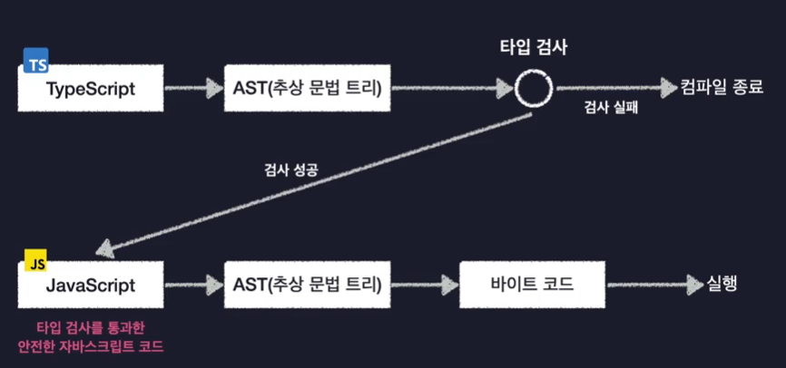

변환된 자바스크립트 코드는 다시 브라우저나 Node.js 환경에서 기존 자바스크립트와 동일한 방식으로 파싱, 컴파일, 실행 과정을 거치게 됩니다.

## 타입스크립트 사용해보기

타입스크립트를 실제로 사용해보고 실행하려면 아래 코드를 따라치면 됩니다.

### 1. 타입스크립트 및 관련 도구 설치

#### 타입스크립트 전역 설치

```cmd
npm install typescript -g
```

#### Node.js 타입 정의 설치

Node.js API를 타입스크립트에서 사용하는 경우 설치합니다.

```cmd
npm i @types/node
```

### 2. 타입스크립트 코드 작성

```typescript
console.log('Hello TypeScript');
const a: number = 1;
```

### 3. 타입스크립트 코드 컴파일/실행

-   타입스크립트 파일을 자바스크립트로 변환(컴파일)해야 실행할 수 있습니다.

#### 기본적인 방법

```cmd
tsc src/index.ts
```

이 명령을 하고 나면 `index.js` 파일이 생성됩니다.

#### 생성된 자바스크립트 파일 실행

```cmd
node src/index.js
```

### 4. tsx로 바로 실행하기

타입스크립트 코드를 별도의 컴파일 없이 한 번에 실행하고 싶은 경우 `tsx`를 사용합니다.

#### tsx 전역 설치

```cmd
npm i -g tsx
```

#### 타입스크립트 파일 즉시 실행

```cmd
tsx src/index.ts
```

이 명령어를 사용하면 별도의 컴파일 과정 없이 바로 실행 결과를 확인할 수 있습니다.

## 타입스크립트 컴파일러 옵션 설정하기

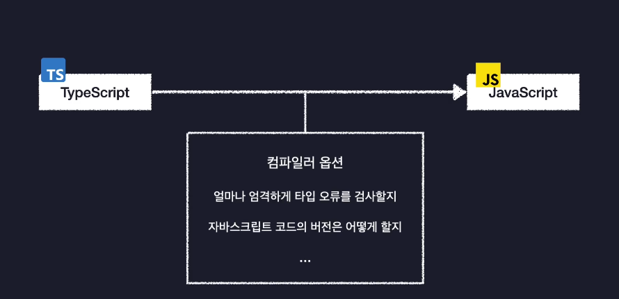

타입스크립트 프로젝트에서는 `tsconfig.json` 파일을 통해 컴파일러의 동작 방식을 세부적으로 설정할 수 있습니다. 이 파일은 프로젝트 루트에 위치하며, Node.js 패키지 단위로 설정할 수 있어 각 프로젝트마다 다르게 적용할 수 있습니다.

### tsconfig.json 파일 생성

```cmd
tsc --init
```

-   위 명령어를 실행하면 프로젝트 루트에 tsconfig.json 파일이 생성됩니다.

### 주요 옵션 살펴보기

#### `include`

컴파일할 파일 또는 디렉터리를 지정합니다.

```json
{
    "include": ["src"]
}
```

-   예시처럼 설정하면 `src` 폴더 내 모든 `.ts` 파일이 컴파일 대상이 됩니다.
-   이 경우 `tsc`라는 명령어 만으로 src 파일 아래에 모든 ts파일의 컴파일 결과 `*.js`파일을 생성할 수 있습니다.

#### `compilerOptions`

컴파일 동작의 핵심을 제어하는 옵션입니다.

##### `target`

-   변환될 자바스크립트 코드의 버전을 지정할 수 있습니다.

```javascript
    "compilerOptions": { "target": "ES5" },
```

-   `ES5`로 설정 시, 최신 문법이 구버전 자바스크립트 문법으로 변환됩니다.
-   `ESNext` 등 최신 버전도 지정 가능하며, 최신 문법을 그대로 사용할 수 있습니다.

```javascript
{
    "compilerOptions": { "target": "ESNext" },
    }
```

##### `module`

모듈 시스템 지정하는 옵션입니다.

```javascript
{
    "compilerOptions": {
        "module": "CommonJS"
    }
}
```

-   Node.js 환경에서는 CommonJS, 브라우저 환경이나 최신 프로젝트에서는 ESNext 등으로 설정할 수 있습니다.

##### `outDir`

컴파일 결과 파일이 생성될 디렉터리 지정하는 옵션입니다.

```json
"compilerOptions": {
    "outDir": "dist"
}
```

-   컴파일된 `.js` 파일이 `dist` 폴더에 생성됩니다.

##### `strict`

엄격한 타입 검사 활성화할 수 있는 옵션입니다.

```json
{
    "compilerOptions": {
        "strict": true
    }
}
```

-   타입 검사를 최대한 엄격하게 하여, 타입 오류를 사전에 방지할 수 있습니다.
-   기존 JS 프로젝트를 점진적으로 마이그레이션할 때는 false로 설정하기도 합니다.

##### moduleDetection

타입스크립트는 모든 파일을 전역 모듈로 보기 때문에 `hello.ts`라는 파일과 `index.ts`라는 파일에서 `a`라는 변수를 선언하면 에러가 발생합니다.

```javascript
const a = 1;
export {};
```

파일 내부에서 `export`또는 `import` 키워드를 한 번이라도 사용하고 나면 해당 파일을 독립된 모듈로 인식하기 때문에 에러를 해결할 수 있습니다.

```json
{
    "compilerOptions": { "moduleDetection": "force" }
}
```

-   `moduleDetection: "force"` 옵션을 사용하면, `export`나 `import`가 없는 파일도 모듈로 간주되어 전역 스코프 오염을 방지할 수 있습니다.

### tsconfig 변경 적용이 안 될 때

-   VSCode 등 에디터에서 tsconfig 변경 사항이 바로 반영되지 않는다면,
    `Ctrl+Shift+P` → `>restart` 명령으로 타입스크립트 서버를 재시작하면 됩니다.
