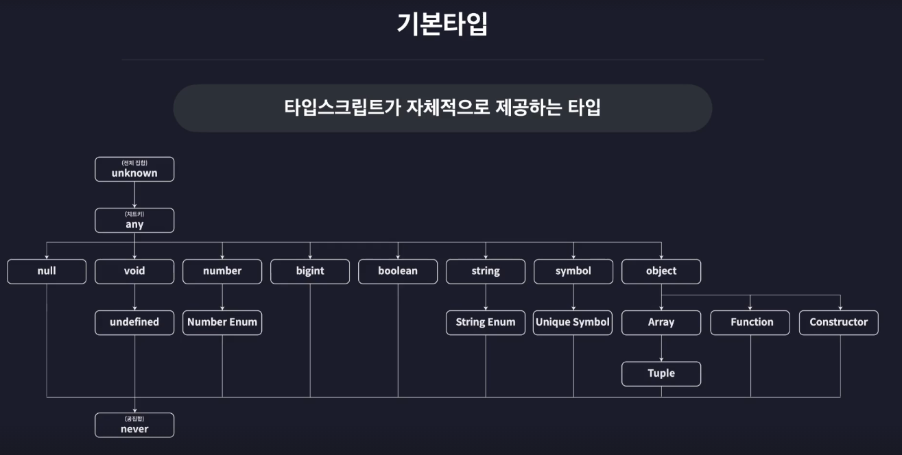
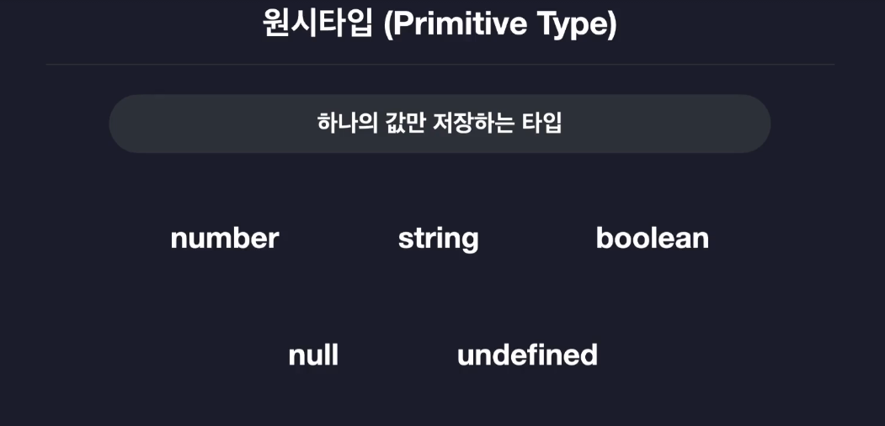

# 타입스크립트 기본

## 타입스크립트의 기본 타입



**기본 타입**은 타입스크립트가 자체적으로 제공하는 타입을 말하며 **내장 타입**이라고도 합니다.

`null`, `undefined`, `number`등과 같이 이미 JavaScript에서 사용하던 타입들도 있고, `unknown`, `any`, `void`, `never`와 같이 생소한 타입들도 있습니다.

> 타입스크립트의 기본 타입은 자바스크립트에서 사용해 왔던 타입에 더해 타입스크립트에만 존재하는 타입들도 포함합니다. 각 타입은 계층 구조로 구성되어 있으며 <ins>상위 타입과 하위타입 간의 관계</ins>가 존재합니다.

### 원시 타입



**원시 타입(Primitive Type)** 은 <ins>값이 변경 불가능(immutable)하며, 객체가 아닌 값</ins>을 의미합니다.

#### Number

`number` 타입은 64비트 부동소수점 숫자(IEEE 754)를 나타내며, 정수, 실수, `Infinity`, `-Infinity`, `NaN`을 모두 포함합니다.

```ts
let num1: number = 123;
```

> 이 때 `[변수 이름]:[타입]` 변수의 타입을 정의하는 문법을 `type annotation`이라고 합니다.

##### Number에 들어갈 수 있는 값

```ts
let num1: number = 123;
let num2: number = -123;
let num3: number = 0.123;
let num4: number = -0.123;
let num5: number = Infinity;
let num6: number = -Infinity;
let num7: number = NaN;
```

#### string

`string`타입에는 문자열을 저장할 수 있습니다.

```ts
let name: string = 'mori';
let str1: string = 'hello';
let str2: string = 'hello';
let str3: string = `hello`;
let str4: string = `hello ${name}`;
```

-   문자열은 `"`, `'`, <code>\`</code>으로 묶어줄 수 있습니다.
-   백틱(<code>\`</code>)을 사용할 때는 템플릿 리터럴로 변수나 표현식을 `${}`로 삽입할 수 있습니다.

#### boolean

`boolean`타입에는 오직 `true`와 `false`만 할당할 수 있습니다.

```ts
let bool1: boolean = true;
let bool2: boolean = false;
```

#### null

`null`타입에는 `null`만 할당할 수 있습니다.

```ts
let null1: null = null;
```

#### undefined

`undefined`타입에는 `undefined`만 할당할 수 있습니다.

```ts
let unde1: undefined = undefined;
```

#### `null` 초기화

`strictNullChecks` 옵션이 `true`일 때는 `number`등 다른 타입 변수에 `null`을 할당할 수 없습니다.
`strictNullChecks` 옵션이 `false`일 때는 `null`과 `undefined`를 모든 타입에 할당할 수 있습니다.

`tsconfig.json`

```json
{
    "include": ["src"],
    "compilerOptions": {
        ...
        "strictNullChecks": false
    }
}
```

-   `strict` 옵션은 여러 엄격한 옵션의 상위 옵션이며, 명시적으로 `strictNullChecks`를 지정하지 않으면 <ins>`strict` 옵션의 값을 따릅니다.</ins>

### 리터럴 타입

리터럴 타입은 특정 값만을 가질 수 있도록 제한하는 타입입니다. 예를 들어, `let numA: 10 = 10`;은 변수 `numA`가 오직 10만 가질 수 있음을 의미합니다.

> 리터럴 타입은 문자열, 숫자, 불리언 모두에 사용할 수 있습니다

```ts
let numA: 10 = 10;
```

### 배열 타입

#### 1. 타입이 한 개인 경우

##### (1) 배열 표기법

```ts
let numArr: number[] = [1, 2, 3];
let strArr: string[] = ['one', 'two', 'three'];
```

-   배열에 들어갈 **원소의 타입**과 `[]`를 콜론 뒤에 적어줍니다.
-   가장 일반적으로 사용되는 배열 타입 표기법입니다.

##### (2) 제네릭 표기법

```ts
let boolArr: Array<boolean> = [true, false, true];
```

-   `Array<타입>`과 같이 꺽쇠 사이에 타입명을 적는 방법도 있습니다.
-   이 방식은 추후에 배울 제네릭 타입 표기법이며, 위의 `number[]` 방식과 완전히 동일하게 동작합니다.

#### 타입이 여러 개인 경우 (유니언 타입)

-   여러 타입을 허용하려면 `(타입1 | 타입2)[]`처럼 괄호로 묶고 타입과 타입 사이에 `|`를 작성해야 합니다.
-   괄호를 생략하면 다른 의미가 되므로 주의해야 합니다.

```ts
let multiArr: (string | number)[] = [1, 'hello'];
```

-   `string`또는 `number`를 원소로 갖는 배열을 만들 수 있습니다.

#### 다차원 배열

다차원 배열은 배열 안에 배열이 존재하는 형태로 **2차원 배열**, **3차원 배열**등을 의미합니다.

다차원 배열을 선언할 때에는 차원의 수만큼 `[]`를 붙여주면 됩니다.

```ts
let doubleArr: number[][] = [
    [1, 2, 3],
    [4, 5],
];
```

-   `doubleArr`은 2차원 배열이므로 `[]`를 두 번 붙여줍니다.
-   3차원 배열은 `number[][][]`처럼 표기합니다.

#### 튜플

튜플은 **길이**와 **각 요소의 타입**이 고정된 배열을 말합니다.
즉, 배열과 비슷하지만 각 인덱스별로 타입이 다를 수 있고, 길이도 고정됩니다.

> 자바스크립트에는 없고, 타입스크립트에만 존재하는 타입입니다.

```ts
let tup1: [number, number] = [1, 2];
let tup2: [number, string, boolean] = [1, '2', true];

tup1.push(1); // 오류 없음! (런타임에는 허용됨)
tup1.pop();
tup1.pop();
```

-   `tup1`은 두 개의 숫자만 가질 수 있습니다.
-   `tup2`는 첫 번째는 숫자, 두 번째는 문자열, 세 번째는 불리언만 순서대로 가질 수 있습니다.
-   튜플도 자바스크립트의 배열이기 때문에 `push`, `pop` 등 배열 메서드를 사용할 수 있습니다.

> **[주의!⚠️]**
> 타입스크립트는 push/pop 등 배열 메서드 사용에 대해 컴파일 에러를 발생시키지 않으므로 사용할 수 있습니다.
> 하지만, 이렇게 하면 튜플의 **길이와 타입 고정**이라는 본래 의도를 벗어날 수 있으니 주의해야 합니다.

##### 튜플의 배열

튜플 타입의 배열을 만들 수도 있습니다.

```ts
const users: [string, number][] = [
    ['조하은', 1],
    ['모리', 2],
    ['홍길동', 3],
    // [5, '최아무개'], 'number' 형식은 'string' 형식에 해당합니다.
];
```

-   이 예시는 "문자열-숫자" 쌍의 튜플로 이루어진 배열입니다.

> 튜플은 **순서와 타입이 모두 중요한 데이터**(예: 좌표, 이름-값 쌍 등)를 다룰 때 유용합니다.
> 단, 요소의 수가 많거나 구조가 복잡해지면 오히려 객체 타입이 더 명확할 수 있습니다.

### 객체

#### 1. 객체 타입의 선언과 구조적 타입 시스템

##### 틀린 예시❌

```ts
let user: object = {
    id: 1,
    name: '조하은',
};

user.id; // ❌
```

-   `object` 타입은 "객체이기만 하면 된다"는 의미로, 구체적인 프로퍼티 타입 정보를 알 수 없습니다.
    따라서 `user.id`와 같이 프로퍼티 접근 시 타입 오류가 발생합니다.
    공식 문서에서도 `object` 타입은 거의 사용하지 말고, 구체적인 객체 리터럴 타입을 선언하라고 적혀 있습니다.

##### 올바른 예시⭕

```ts
let user: { id: number; name: string } = {
    id: 1,
    name: '조하은',
};

user.id; // ⭕
```

-   객체의 구조(프로퍼티와 타입)를 명확히 지정하면, 해당 프로퍼티에 안전하게 접근할 수 있습니다.
-   이러한 타입을 **객체 리터럴 타입**이라고 합니다.

##### 구조적 타입 시스템

-   타입스크립트는 **구조적 타입 시스템**을 사용합니다. 즉, 타입의 이름이 아니라 **구조(프로퍼티와 타입)**가 일치하면 같은 타입으로 간주합니다.
-   반대로, **명목적 타입 시스템**은 타입의 이름이나 선언이 일치해야 같은 타입으로 간주합니다. 예를 들어, `Java`, `C#` 등은 명목적 타입 시스템을 사용합니다.

#### 옵셔널 프로퍼티

속성 뒤에 `?`를 붙여주면 해당 프로퍼티가 있어도 되고 없어도 된다는 뜻이 됩니다.

> 있어도 되고 없어도 되는 프로퍼티를 **선택적 프로퍼티**라고 합니다.

```ts
let user: { id?: number; name: string } = {
    name: '조하은',
};
```

-   `id`프로퍼티는 있어도 되고 없어도 되지만, 만약 있다면 `number`여야 된다는 뜻입니다.

#### 읽기 전용 프로퍼티

절대 값이 수정되어서는 안되는 프로퍼티의 경우 `readonly`라는 키워드를 붙여서 읽기 전용 프로퍼티로 만들 수 있습니다.

> `readonly` 키워드를 붙이면, 해당 프로퍼티는 <ins>객체 생성 후 값을 변경할 수 없습니다.</ins>

```ts
let config: { readonly apiKey: string } = {
    apiKey: 'MY API KEY',
};

config.apiKey = 'NEW KEY'; // ❌
```

#### 타입 별칭

동일한 형태의 객체를 반복해서 선언할 때, 타입 별칭을 사용하면 코드 중복을 줄이고 가독성을 높일 수 있습니다.

타입 별칭은 `type` 키워드로 선언하며, 변수처럼 재사용할 수 있습니다.

```ts
type User = { id: number; name: string; nickname: string };

let user1: User = { id: 1, name: '조하은', nickname: 'hani' };
let user2: User = { id: 1, name: '모리', nickname: 'mori' };
```

##### 타입 별칭 사용 시 주의사항

-   **중복 선언 금지:**
    같은 스코프 내에서 동일한 이름으로 타입 별칭을 선언하면 오류가 발생합니다.

-   **런타임 영향 없음:**
    타입 별칭은 컴파일 타임에만 존재하며, JavaScript 코드로 변환될 때는 모두 제거됩니다.

#### 인덱스 시그니처

인덱스 시그니처는 <ins>객체의 키와 값의 타입 규칙을 정의하는 문법</ins>입니다.
임의의 키에 특정 타입의 값을 저장하는 객체를 표현할 때 유용합니다.

```ts
type countryCodes = {
    [key: string]: string;
};

let countryCodes: countryCodes = {
    Korea: 'ko',
    UnitedState: 'us',
    UnitedKingdom: 'uk',
};
```

> 키와 밸류의 규칙이 정해진 타입을 정의할 때 유용하게 사용할 수 있습니다!

```ts
type countryNumberCodes = {
    [key: string]: number;
};

let emptyCountryNumbers: countryNumberCodes = {}; // 에러가 발생하지 않습니다.
```

-   프로퍼티가 아예 존재하지 않는 경우 에러가 발생하지 않습니다.

##### 필수 프로퍼티

반드시 있어야 하는 `Property`의 경우, 따로 명시해줍니다.

```ts
type countryNumberCodes = {
    [key: string]: number;
    Korea: number;
};
```

-   이 경우, `Korea` 프로퍼티는 반드시 존재해야 하며, 타입도 `number`여야 합니다.

```ts
let emptyCountryNumbers: countryNumberCodes = {}; // 에러가 발생합니다.
```

-   변경 후에는 `Korea`라는 속성이 존재하지 않아 에러가 발생하게 됩니다.

```ts
type countryNumberCodes = {
    [key: string]: number;
    Korea: string;
};
```

-   인덱스 시그니처의 값의 타입과 필수 프로퍼티의 타입은 반드시 일치하거나, 호환되어야 합니다.
    위와 같이 선언하면 에러가 발생합니다.

왜냐하면 `Korea` 프로퍼티는 `string` 타입이지만, 인덱스 시그니처는 모든 프로퍼티가 `number` 타입이어야 한다고 명시했기 때문입니다.

### 열거형 타입(Enumerable Type)

`enum` 타입은 **여러 상수 값에 이름을 부여해 집합적으로 관리**할 수 있는 타입입니다.
코드의 가독성을 높이고, 값의 의미를 명확하게 표현할 수 있습니다.

> `enum`은 자바스크립트에는 없고 타입스크립트에서만 제공되는 문법입니다.

#### 예시: enum 없이 상수만 사용하는 경우

```ts
const user1 = {
    name: '조하은',
    role: 0, // 0: 관리자
};

const user2 = {
    name: '모리',
    role: 1, // 1: 일반 유저
};

const user3 = {
    name: '아무개',
    role: 2, // 2: 게스트
};
```

-   시간이 지나면 각 숫자가 무엇을 의미하는지 헷갈릴 수 있습니다.

#### enum 사용 예시

```ts
enum Role {
    ADMIN = 0,
    USER = 1,
    GUEST = 2,
}

const user1 = {
    name: '조하은',
    role: Role.ADMIN,
};

const user2 = {
    name: '모리',
    role: Role.USER,
};

const user3 = {
    name: '아무개',
    role: Role.GUEST,
};
```

-   `enum`을 사용하면 각 역할이 명확하게 표현되어 코드의 의미가 명확해집니다.

#### enum의 기본 동작

-   값을 명시하지 않으면 첫 번째 값이 `0`부터 시작해 `1`씩 증가합니다.
-   맨 위에만 값을 지정하면 이후 값은 자동으로 `1`씩 증가합니다.

```ts
enum Example {
    FIRST = 10, // 10
    SECOND, // 11
    THIRD, // 12
}
```

-   **문자열 enum**도 지원합니다.

```ts
enum Language {
    KOREAN = 'ko',
    ENGLISH = 'en',
    JAPANESE = 'jp',
}
```

> `enum`은 컴파일 결과 `JS` 코드에도 남아있으며 사라지지 않습니다.

### Any

`any`는 특정 변수의 타입을 확실히 알 수 없거나, 타입 검사를 피하고 싶을 때 사용할 수 있는 타입입니다.

> `Any`는 자바스크립트에는 없고 타입스크립트에서만 제공되는 타입입니다.

```ts
let anyVar: any = 10;
anyVar = 'hello';
anyVar = true;
anyVar = {};
anyVar = () => {};
```

-   `any`로 선언된 변수에는 모든 타입의 값을 자유롭게 할당할 수 있습니다.

```ts
anyVar.toUpperCase();
anyVar.toFixed();
```

-   `any` 타입 변수는 어떤 속성이나 메서드도 제한 없이 사용할 수 있습니다.
    타입스크립트 컴파일러가 타입 오류를 체크하지 않습니다.

```ts
let num: number = 10;
num = anyVar; // ⭕
```

-   `any` 타입 변수는 다른 모든 타입 변수에 할당할 수 있습니다.

> `any`타입은 타입스크립트의 타입 검사를 우회하는 **치트키**라고 생각하면 됩니다. 그러나 **타입 오류가 런타임에 발생**할 수 있기 때문에 , 타입스크립트의 장점을 모두 포기하는 셈입니다. **실무에서는 꼭 필요한 경우가 아니면 사용을 지양하는 것이 좋습니다.**

### Unknown

`unknown`은 `any`와 비슷하게 모든 타입의 값을 할당할 수 있지만, **타입 안전성을 보장**하는 타입입니다.

> `Unknown`은 자바스크립트에는 없고 타입스크립트에서만 제공되는 타입입니다.

```ts
let unknownVar: unknown;
unknownVar = '';
unknownVar = 1;
unknownVar = () => {};
```

-   `unknown`타입 변수에도 모든 타입의 값을 할당할 수 있습니다.

```ts
let num: number = 1;
num = unknownVar; // ❌
unknownVar.toUpperCase(); // ❌
unknownVar.toFixed(); // ❌
```

-   `unknown` 타입 변수는 다른 타입 변수에 바로 할당할 수 없습니다.
-   메서드 호출, 프로퍼티 접근, 연산 등도 **바로 사용할 수 없습니다.**

```ts
if (typeof unknownVar === 'number') {
    num = unknownVar;
}
```

-   `unknown` 타입의 값을 사용하려면, **타입을 먼저 검사**해야 합니다.
-   이러한 과정을 **타입 정제**라고 하며, 다음 섹션에서 자세히 배웁니다.

> `unknown`은 타입을 알 수 없는 값에 대해 **안전하게 코드를 작성**할 수 있도록 도와줍니다.
> 타입 확인을 강제하므로, `any`보다 훨씬 안전합니다.

### Void

`void` 타입은 **값이 없음을 명시적으로 나타내는 타입**입니다.
주로 함수의 반환 타입으로 사용하며, 함수가 값을 반환하지 않을 때 `void`를 지정합니다

```ts
function func1(): string {
    return 'hello';
}

function func2(): void {
    console.log('hello');
}
```

-   타입스크립트에서는 함수의 반환값의 타입을 설정할 수 있습니다.
-   `func1`은 문자열을 반환하므로 반환 타입이 `string`입니다.
-   `func2`는 값을 반환하지 않으므로 반환 타입이 `void`입니다.

```ts
let a: void;

a = 10; ❌
a = 'hello'; ❌
a = undefined; ⭕
```

-   `void` 타입 변수에는 오직 `undefined`만 할당할 수 있습니다.
-   `strictNullChecks` 옵션이 꺼져 있다면 `null`도 할당할 수 있습니다.

#### 의문| 왜 undefined가 아닌 void를 사용할까?🤔

```ts
function func2(): undefined {
    console.log('hello');
}
```

-   함수 반환 타입을 `undefined`로 지정하면, 반드시 `return undefined;`를 명시적으로 작성해야 오류가 발생하지 않습니다.
-   반면, `void`는 `return`문을 작성하지 않아도 오류가 발생하지 않습니다.

#### void 타입의 특징 및 주의점

-   `void`는 주로 함수 반환 타입으로만 사용합니다. 변수 타입으로는 실질적인 의미가 거의 없습니다.
-   함수에서 `void`를 반환 타입으로 지정해도, 실제로는 `undefined`가 반환됩니다.
-   `void` 타입 함수에서 값을 명시적으로 반환해도 타입스크립트는 엄격하게 검사하지 않습니다.
    (예: `return 1;`을 해도 오류가 발생하지 않는 경우가 있습니다. 이는 콜백 함수 등에서의 유연성을 위한 설계입니다.)

### Never

`Never`타입은 **절대 값이 발생하지 않는 타입**을 의미합니다.
즉, 함수가 정상적으로 종료되지 않거나, 항상 예외를 던지는 경우에 사용합니다.

```ts
function func3(): never {
    while (true) {}
}

function func4(): never {
    throw new Error();
}
```

-   `func3`는 무한 루프이므로 값을 절대 반환하지 않습니다.
-   `func4`는 항상 예외를 던지므로 정상적으로 값을 반환하지 않습니다.

```ts
let a: never;

a = 10; ❌
a = 'hello'; ❌
a = undefined; ❌
a = null; ❌
```

-   `never` 타입으로 변수를 선언하는 경우 `undefined`도 할당할 수 없습니다.
-   `strictNullChecks`옵션이 꺼져 있다고 하더라도 `null`을 할당할 수 없습니다.
-   `any`타입의 값도 할당할 수 없습니다.

#### never의 특징

-   `never`는 모든 타입의 하위 타입입니다. 따라서 어디에도 할당될 수 있지만, 반대로 어떤 타입도 `never`에 할당될 수 없습니다.
-   주로 **예외 처리 함수, 무한 루프 함수, switch문에서 모든 케이스를 처리한 후 남는 불가능한 분기** 등에 사용합니다.
