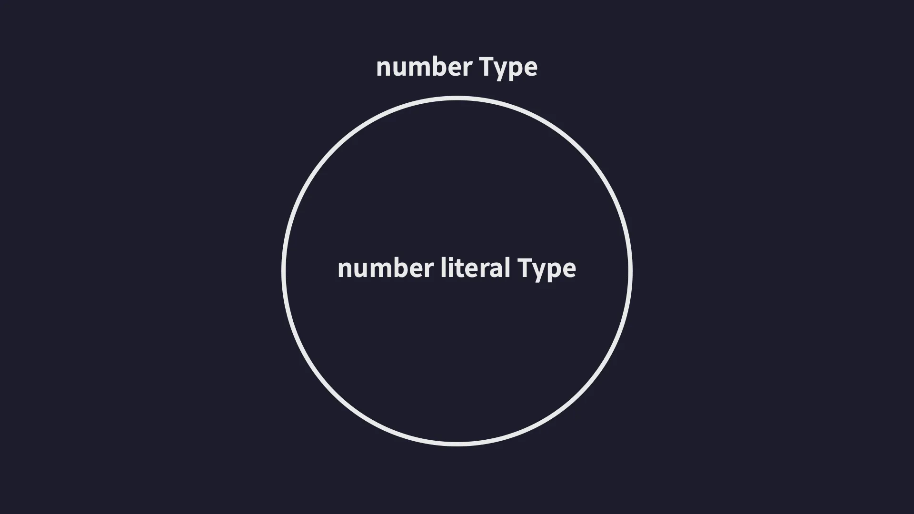

# 타입 스크립트 이해하기

> 이정환 강사님의 인프런 강의 [한 입 크기로 잘라먹는 타입 스크립트]를 듣고 정리한 내용입니다.

## 타입스크립트의 진짜 이해란?

> 타입스크립트를 이해한다는 것은 단순히 문법을 외우는 것이 아니라, 다음 내용들을 이해하는 것입니다.
>
> -   **타입이 어떻게 정의되는지**
> -   **타입들 사이의 관계가 어떻게 설정되는지**
> -   **코드의 오류가 어떤 원리로 검사되는지**

이 근본적인 원리와 동작 방식을 깊이 있게 이해하는 것을 타입스크립트의 진짜 이해라 할 수 있습니다.

공식 문서에서도 [문법 치트시트](https://www.typescriptlang.org/cheatsheets/)를 제공하고 있지만, 타입스크립트의 문법만 암기해서는 실무 문제를 해결하는데 한계가 있습니다.

원리와 개념에 대한 수준급 이해를 갖추고 있어야 새롭거나 어려운 문제를 맞닥뜨렸을 때 스스로의 힘으로 해결할 수 있습니다.

## 타입은 집합이다

타입스크립트의 '타입'은 여러 개의 값을 포함하는 **'집합'** 입니다.

> **[집합이란?]**
> : 동일한 속성을 갖는 여러 요소를 하나의 그룹으로 묶은 단위!


-   타입스크립트에서는 여러 개의 숫자 값을 묶어 놓은 집합을 `number`타입이라고 부릅니다.


-   `Number Literal` 타입은 숫자를 나타내는 타입 중에서도 **딱 하나의 값**만 포함하는 아주 작은 집합입니다.
-   숫자 리터럴 타입은 특정 숫자 하나만을 값으로 가질 수 있으므로, `number` 타입의 부분집합입니다.

### `Number`와 `Number Literal`의 집합 관계



타입스크립트의 **모든 타입은 집합**으로써 서로 포함(상속)하거나 포함되는 관계를 가집니다.


-   다른 타입을 포함하는 타입을 **슈퍼 타입** 또는 **부모 타입**이라고 합니다.
-   다른 타입에 포함되는 타입을 **서브 타입** 또는 **자식 타입**이라고 합니다.

타입 간의 관계를 타입 계층도로 표현하면 다음과 같습니다.


## 타입의 호환성

타입 호환성이란 **한 타입의 값을 다른 타입으로 사용할 수 있는지**를 판단하는 것입니다.

예를 들어 `A`라는 타입과 `B`라는 타입이 존재할 때, `A`타입의 값을 `B`타입으로 취급해도 괜찮은지 판단하는 것입니다. 이때 취급되어도 괜찮으면 **호환된다**고 하고, 그렇지 않으면 **호환되지 않는다**라고 합니다.

### 예시 (그림)


`Number` 타입과 `Number Literal` 타입이 있을 때 서브 타입인 `Number Literal` 타입의 값을 슈퍼 타입인 `Number` 타입의 값으로 취급하는 것은 가능합니다. 그러나 반대의 경우는 불가능합니다.

> 정사각형은 직사각형이지만, 직사각형은 정사각형이라 할 수 없는 것과 같습니다.

### 예시 (코드)


`number`타입 변수인 `num1`에 `Number Literal`타입 변수인 `num2`의 값을 저장하는 것은 가능합니다.

-   `number`타입이 더 큰 타입이기 때문입니다.


`Number Literal`타입 변수인 `num2`에 `number`타입 변수인 `num1`의 값을 저장하는 것은 불가능합니다.

-   `num1`에는 10 외에도 다양한 숫자 값을 담을 수 있지만, `num2`에는 10외의 다른 값을 절대 저장할 수 없기 때문입니다.

### 업캐스팅과 다운캐스팅

즉, 타입스크립트에서는 슈퍼타입의 값을 서브타입의 값으로 취급하는 것을 허용하지 않습니다.

> -   서브 타입의 값을 슈퍼 타입의 값으로 취급하는 것은 가능합니다.
> -   슈퍼 타입의 값을 서브 타입의 값으로 취급하는 것은 불가능합니다.


-   서브 타입의 값을 슈퍼 타입의 값으로 취급하는 것을 **업 캐스팅**이라고 합니다.
-   슈퍼 타입의 값을 서브 타입의 값으로 취급하는 것을 **다운 캐스팅**이라고 합니다.
-   업캐스팅(서브 타입 → 슈퍼 타입)은 항상 가능하지만,
    다운캐스팅(슈퍼 타입 → 서브 타입)은 타입이 확실히 일치하는 경우를 제외하면 불가능합니다.

## unknown 타입 (전체 집합)

`unknown` 타입은 타입 계층도의 최상위에 존재하는 슈퍼타입입니다.

-   `unknown`타입 변수에는 모든 타입의 값을 할당(업캐스팅)할 수 있습니다.
-   즉, 모든 타입은 `unknown` 타입의 서브타입(부분집합)입니다.
-   `unknown`타입을 다른 타입으로 다운 캐스팅하는 건 허용되지 않습니다.
-   예외적으로 `any`타입 변수에는 할당할 수 있습니다.

```ts
function unknownExam() {
    let a: unknown = 1;
    let b: unknown = 'hello';
    let c: unknown = true;
    let d: unknown = null;
    let e: unknown = undefined;
}

let unknownValue: unknown;

let a: number = unknownValue; // unknown -> number ❌
let b: any = unknownValue; // unknown -> any
```

## never 타입 (공집합 타입)

`never` 타입은 타입 계층도의 최하위에 존재하는 서브타입입니다.

-   `never` 타입은 공집합으로, 어떤 값도 가질 수 없습니다.
-   모든 타입의 서브타입이므로 어떤 타입이든 업캐스팅이 가능합니다.
-   반대로, 어떤 타입의 값도 `never` 타입 변수에 다운캐스팅할 수 없습니다.

```ts
let neverVar: never;

// 업캐스팅: never 타입의 값을 다른 타입 변수에 할당 (가능)
let a: number = neverVar; // never -> number
let b: string = neverVar; // never -> string
let c: boolean = neverVar; // never -> boolean
let d: null = neverVar; // never -> null
let e: undefined = neverVar; // never -> undefined
let f: [] = neverVar; // never -> Array
let g: {} = neverVar; // never -> Object

// 다운캐스팅: 다른 타입의 값을 never 타입 변수에 할당 (불가능)
let a: never = 1; // number -> never ❌
let b: never = 'hello'; // string -> never ❌
let c: never = true; // boolean -> never ❌
let d: never = null; // null -> never ❌
let e: never = undefined; // undefined -> never ❌
let f: never = []; // Array -> never ❌
let g: never = {}; // Object -> never ❌
```

## void 타입

-   `void` 타입은 일반적으로 반환값이 없는 함수의 반환 타입으로 사용됩니다.
-   `void`타입은 `undefined` 타입의 슈퍼타입입니다.

```ts
function voidFunc(): void {
    console.log('hi');
    return undefined; //문제가 되지 않음
}
```

-   반환값을 `void`로 선언한 함수에서 `undefined`를 반환해도 오류가 발생하지 않습니다. (업캐스팅)

## any 타입

-   `any` 타입은 타입 계층도를 무시하는 특수 타입입니다.(치트키!)
-   `any` 타입은 모든 타입의 슈퍼 타입이면서 모든 타입의 서브 타입입니다.(단, `never` 타입은 제외)
    -   `any` 타입의 값을 `never` 타입 변수에 할당하는 것은 허용되지 않습니다.

```ts
let anyValue: any;

let num: number = anyValue; // any -> number (다운캐스팅)
let str: string = anyValue; // any -> string (다운캐스팅)
let bool: boolean = anyValue; // any -> boolean (다운캐스팅)
let never: never = anyValue; // any -> never (다운캐스팅) ❌

anyValue = num; // number -> any (업캐스팅)
anyValue = str; // string -> any (업캐스팅)
anyValue = bool; // boolean -> any (업캐스팅)
```

## 객체 타입 간의 호환성

타입스크립트에서 객체 타입도 기본 타입처럼 슈퍼타입/서브타입 관계를 가집니다.
이때, 객체 타입의 호환성은 **프로퍼티의 구조(Shape)**를 기준으로 결정됩니다.
이런 방식을 구조적 타이핑이라고 합니다.

```ts
type Animal = { name: string; color: string };
type Dog = { name: string; color: string; breed: string };

let animal: Animal = { name: '기린', color: 'yellow' };
let dog: Dog = { name: '모리', color: 'white', breed: '말티즈' };

animal = dog; // dog -> animal (업캐스팅)
dog = animal; // animal -> dog (다운캐스팅) ❌
```

-   `Dog` 타입은 `Animal`타입의 모든 프로퍼티를 갖고 있습니다.
    -   따라서 `Dog` 타입은 `Animal` 타입에도 해당되는 객체입니다.
-   `Animal` 타입은 `breed`라는 속성이 없기 때문에 `Dog` 타입 객체로 보기는 어렵습니다.
-   즉 `Dog`타입은 `Animal`타입의 서브 타입이고, `Animal`타입은 `Dog`타입의 슈퍼 타입입니다.

> 프로퍼티가 더 적은 타입이 슈퍼타입,
> 프로퍼티가 더 많은 타입이 서브타입입니다.

### 초과 프로퍼티 검사

타입스크립트는 **객체 리터럴**을 사용할 때, 선언된 타입에 없는 프로퍼티가 있으면 초과 프로퍼티 검사를 수행해 오류를 발생시킵니다.

```ts
type Book = {
    name: string;
    price: number;
};

type ProgrammingBook = {
    name: string;
    price: number;
    skill: string;
};

let book: Book;
let programmingBook: ProgrammingBook = {
    name: '한 입 크기로 잘라먹는 리액트',
    price: 33000,
    skill: 'reactjs',
};

book = programmingBook;

let book2: Book = { name: '한 입 크기로 잘라먹는 리액트', price: 33000, skill: 'reactjs' };
```

-   변수에 객체 리터럴을 직접 할당할 때 **초과 프로퍼티 검사**가 발생하게 됩니다 이 때 선언된 타입에 없는 프로퍼티가 있으면 오류를 발생시킵니다.
-   하지만 이미 선언된 객체를 할당할 때에는 초과 프로퍼티 검사가 적용되지 않습니다.

```ts
function func(book: Book) {}

func({
    // 오류 발생
    name: '한 입 크기로 잘라먹는 리액트',
    price: 33000,
    skill: 'reactjs', // 오류: 초과 프로퍼티 검사
});
```

-   초과 프로퍼티 검사는 함수의 매개변수에도 동일하게 발생합니다.
-   함수에 객체 리터럴을 직접 전달하면, 타입에 선언되지 않은 프로퍼티가 있을 경우 오류가 발생합니다.

#### 초과 프로퍼티 검사 우회법

-   초과 프로퍼티 검사를 피하려면, 객체 리터럴을 변수에 먼저 할당한 뒤 그 변수를 사용하면 됩니다.

```ts
const myBook = {
    name: '한 입 크기로 잘라먹는 리액트',
    price: 33000,
    skill: 'reactjs',
};
func(myBook); // OK: 초과 프로퍼티 검사 없음
```

## 대수 타입

대수 타입이란 여러 개의 타입을 조합해서 새로운 타입을 만드는 방식을 말합니다.
대표적으로 **합집합**과 **교집합**이 있습니다.

### 합집합(Union) 타입

합집합 타입은 여러 타입 중 **하나**의 타입을 가질 수 있도록 하는 타입입니다. `|` 기호를 사용하여 선언하며, 결합할 수 있는 타입의 수에는 제한이 없습니다.

#### (예시) string | number

`string`과 `number`의 유니온 타입도 정의할 수 있습니다.


`string`타입과 `number` 타입의 교집합은 없기 때문에 그림으로 표현하면 위와 같습니다.

```ts
let a: string | number;
a = 'hello';
a = 1;
```

-   위 코드에서 a는 `string` 또는 `number` 타입의 값을 모두 가질 수 있습니다.

#### Union 타입으로 배열 타입 정의하기

```ts
let arr: (string | number | boolean)[] = [1, 'hello', true];
```

-   union 타입을 사용하면 다양한 타입의 값을 요소로 갖는 배열을 정의할 수 있습니다.

#### Union 타입과 객체 타입

여러 객체 타입도 Union 타입으로 정의할 수 있습니다.

```ts
type Dog = {
    name: string;
    color: string;
};

type Person = {
    name: string;
    language: string;
};

type Union = Dog | Person;
```

-   위의 `Union` 타입은 `Dog` 타입 또는 `Person` 타입, 혹은 두 타입의 <ins>모든 프로퍼티를 가진 객체(교집합)</ins>도 허용합니다.

정의된 `Union` 타입은 다음과 같이 교집합이 존재하는 두 집합의 합집합 그림으로 표현할 수 있습니다.


`Union` 타입의 객체를 코드로 표현하면 다음과 같습니다.

```ts
let union1: Union = { name: '하은', language: 'korean' }; // Person 타입
let union2: Union = { name: '모리', color: 'white' }; // Dog 타입
let union3: Union = { name: '모리', color: 'white', language: 'korean' }; // Dog & Person의 모든 프로퍼티를 가진 객체
let union4: Union = { name: '홍길동' }; // ❌ color 또는 language 중 하나는 반드시 필요
```

-   이 때, union4 객체는 `Union` 타입이 아니므로 에러가 발생합니다.
    -   `language` 속성이 없기 때문에 `Person`타입이 아닙니다.
    -   `color` 속성이 없기 때문에 `Dog` 타입이 아닙니다.
    -   `name` 속성만 있고 `color`와 `language` 속성 없기 때문에 교집합도 아닙니다.

그림으로 표현하면 다음과 같습니다.


### 교집합(Intersection) 타입

교집합 타입은 여러 타입을 모두 만족하는 타입을 의미합니다. `&` 기호를 사용하여 선언하며, 결합할 수 있는 타입의 수에는 제한이 없습니다.

> 이 때, 기본 타입을 가지고 `Intersection Type`을 만들면 웬만하면 `never` 타입입니다. (교집합이 존재하지 않는 경우가 많기 때문에!)

#### (예시) string & number

`string`과 `number`의 인터섹션 타입도 정의할 수 있습니다.


`string` 타입과 `number` 타입은 서로 겹치는 값이 없기 때문에, 교집합은 존재하지 않아 `never` 타입이 됩니다.

```ts
let variable: number & string;
// number와 string의 교집합은 없기 때문에 never 타입이 된다
```

-   마우스 커서를 갖다 대면 공집합인 `never` 타입으로 추론되는 것을 확인할 수 있습니다.

#### Intersection 타입과 객체 타입

```ts
type Dog = {
    name: string;
    color: string;
};

type Person = {
    name: string;
    language: string;
};

type Intersection = Dog & Person;

let intersection1: Intersection = { name: '모리', language: 'korean', color: 'white' };
```

-   **Intersection** 타입의 객체는 `Dog`와 `Person`의 모든 프로퍼티를 모두 포함해야 합니다.


그림으로 표현하면 위와 같습니다.

## 타입 추론

타입스크립트는 타입을 명시하지 않은 변수의 타입을 <ins>자동으로 추론</ins>합니다. 이런 기능을 **"타입 추론"**이라고 합니다.

타입스크립트는 타입을 지정하지 않은 경우, 변수에 할당된 값을 바탕으로 타입을 다음과 같이 추론합니다.

```ts
let a = 10; // number 타입으로 추론
let b = 'hello'; // string 타입으로 추론
```

그러나 함수의 매개변수 타입은 자동으로 추론되지 않습니다.

```ts
function func(param) {
    // param의 타입을 추론할 수 없음 ❌
}
```

-   타입 추론이 불가능한 변수는 <ins>암묵적 `any`</ins>타입으로 추론됩니다.
-   `strict` 옵션(엄밀히 말하면 `noImplicitAny`)이 활성화된 **엄격한 타입 검사 모드**에서는 오류가 발생합니다.

### 타입 추론이 가능한 상황

#### 1. 초기값이 있는 변수의 타입 추론

```ts
let a = 10; // number 타입으로 추론
let b = 'hello'; // string 타입으로 추론

let c = {
    id: 1,
    name: '이정환',
    profile: {
        nickname: 'winterlood',
    },
    urls: ['https://winterlood.com'],
}; // id, name, profile, urls 프로퍼티가 있는 객체 타입으로 추론
```

#### 2. 구조 분해 할당

객체와 배열을 구조 분해 할당하면, 각 요소의 타입이 **원본의 속성**또는 **인덱스**를 기준으로 추론됩니다.

```ts
let { id, name, profile } = c;
let [one, two, three] = [1, 'hello', true];
```

#### 3. 함수의 반환값 및 매개변수

함수의 반환값 타입은 `return`문을 기준으로 추론됩니다. 함수 매개변수는 기본값이 있을 경우, 그 기본값을 바탕으로 타입이 추론됩니다.

```ts
function func(message = 'hello') {
    // message: string 타입으로 추론
    return 'hello'; // 반환값: string 타입으로 추론
}
```

#### 4. const 상수의 타입 추론

`const`로 선언된 상수는 값이 변경될 수 없으므로 **가장 좁은 타입**인 리터럴 타입으로 추론됩니다.

```ts
const num = 10; // 10 (number literal) 타입으로 추론

const str = 'hello'; // "hello" (string literal) 타입으로 추론
```

#### 5. 최적 공통 타입

여러 타입의 요소가 포함된 배열을 초기값으로 선언하면, 타입스크립트는 **최적의 공통 타입**으로 추론합니다.

```ts
let arr = [1, 'string']; // (string | number)[] 타입으로 추론
```

### 주의해야 할 타입 추론

#### 1. 암묵적 any 타입 추론

변수를 선언할때 초기값을 생략하면, 타입스크립트는 암묵적으로 `any` 타입으로 추론됩니다. 함수 매개변수의 타입이 암묵적으로 `any`가 될 때는 `strict` 모드에서 오류가 발생하지만, 일반 변수는 오류가 발생하지 않습니다.

```ts
let d; // 암묵적 any 타입으로 추론
d = 10;
d.toFixed();

d = 'hello';
d.toUpperCase();
d.toFixed(); // 오류 ❌ (string에는 toFixed가 없음)
```

-   `d = 10;` 이후에는 d가 `number` 타입으로 간주됩니다.
-   `d = 'hello';` 이후에는 d가 `string` 타입으로 간주됩니다.
-   암묵적으로 추론된 `any` 타입은 코드의 흐름에 따라 타입이 계속 변화하는데 이를 **`any`의 진화**라고 합니다.

> **[주의⚠️]** > `let anyType : any;`처럼 명시적으로 `any`타입으로 선언한 변수의 경우, 어떤 값을 할당해도 타입이 `any`로 유지됩니다.

## 타입 단언

**타입 단언**이란 개발자가 특정 값의 타입을 컴파일러보다 더 잘 알고 있다고 판단할 때, 해당 값의 타입을 명시적으로 지정하는 방법입니다.
이는 다른 언어의 타입 캐스팅과 유사하지만, 실제로 타입 변환이 일어나는 것은 아니며, 컴파일러에게 "이 값은 내가 지정한 타입으로 간주하라"고 지시하는 역할을 합니다.

> 타입 단언은 **컴파일 타임에만 영향**을 주며, 런타임에는 영향을 주지 않습니다.

### 타입 단언의 문법

#### `as` 키워드

타입 단언은 주로 `as`키워드를 사용하여 작성합니다. 기본 형태는 다음과 같습니다.

```ts
값 as 타입;
```

##### 예시

```ts
const str = 'hello' as string; //str은 string literal이 아닌 string 타입으로 추론됨
```

-   `str`에 커서를 올리면 `string`타입으로 추론되는 것을 확인할 수 있습니다.

### 타입 단언의 규칙

타입 단언은 <ins>값의 실제 타입과 단언하려는 타입이 **슈퍼타입** 또는 **서브타입** 관계일 때만 허용</ins>됩니다.

서로소 타입 간에는 직접 단언이 불가능하며, 이 경우 `unknown` 또는 `any`를 거쳐 **다중 단언**을 사용해야 합니다.

```ts
let num1 = 10 as never; // never로 추론: number는 never의 슈퍼타입
let num2 = 10 as unknown; // unknown으로 추론: number는 unknown의 서브타입
let num3 = 10 as string; // 오류❌ : number와 string은 서로소 타입
```

### 타입 단언의 적절한 사용

타입 단언은 앞에서 말했듯이, 타입스크립트의 컴파일러보다 개발자가 해당 타입을 더 잘 알고 있는 경우 사용해야 합니다. 자바스크립트 기반 코드를 타입스크립트 코드로 점진적 변환을 하는 경우에도 자주 사용됩니다.

#### 예시

```ts
type Person = {
    name: string;
    age: number;
};

let person: Person = {}; // 오류 ❌
person.name = '';
person.age = 23;
```

-   `person` 변수가 정의되는 시점에 `name`과 `age`라는 속성이 정의돼있지 않기 때문에 `Person`타입이 아닙니다.

```ts
type Person = {
    name: string;
    age: number;
};

let person = {} as Person; // 오류 없음
person.name = '';
person.age = 23;
```

-   위 코드는 빈 객체를 `Person` 타입으로 단언하여, 이후 프로퍼티를 추가할 수 있습니다.
-   단, 실제로 프로퍼티가 존재하지 않음에도 타입 오류가 발생하지 않으므로 주의가 필요합니다.

또한 타입 단언을 이용해 **초과 프로퍼티 검사**를 피할 수도 있습니다.

```ts
type Dog = {
    name: string;
    color: string;
};

let dog: Dog = {
    name: '돌돌이',
    color: 'brown',
    breed: '진도',
} as Dog;
```

-   `breed` 라는 초과 프로퍼티가 있지만, 타입 단언으로 인해 오류가 발생하지 않습니다.

### 다중 단언

타입 단언은 다중으로도 가능합니다. 다중 단언을 사용하면 `number` 타입의 값을 `string`타입으로 단언할 수 있습니다.

```ts
let num3 = 10 as unknown as string; // number -> unknown -> string
```

-   [단언 순서]
    1. `number` 타입을 `unknown`타입으로 단언
    2. `unknown`타입을 `string`타입으로 단언
-   타입 단언은 단순히 눈속임하는 것과 같기 때문에, 좋은 방법은 아닙니다. 오류 발생 확률이 높아집니다.

### const 단언

`as const`를 사용하면 변수를 `const`로 선언한 것 과 비슷하게 타입을 변경할 수 있습니다.

```ts
let num4 = 10 as const; // 10 (number literal) 타입으로 단언

let cat = {
    name: '야옹이',
    color: 'yellow',
} as const; // // 모든 프로퍼티가 readonly 및 리터럴 타입으로 단언
```

### Non Null 단언

값 뒤에 느낌표(`!`)를 붙이면, 해당 값이 `null` 또는 `undefined`가 아님을 컴파일러에게 알려주게 됩니다.

```ts
type Post = {
    title: string;
    author?: string;
};

let post: Post = {
    title: '게시글1',
};

const len: number = post.author!.length;
```

### 타입 단언 사용 시 주의사항

-   타입 단언은 컴파일러의 타입 검사를 우회하므로, 실제 타입과 다를 경우 **런타임 오류**가 발생할 수 있습니다.
-   타입 단언 남용은 타입스크립트의 타입 안전성을 저해하므로, 타입 추론이나 타입 가드로 해결이 불가능한 경우에만 사용해야 합니다.

## 타입 좁히기

**타입 좁히기**란 조건문 등 코드의 흐름을 활용해 넓은 타입에서 더 구체적인(좁은) 타입으로 값의 범위를 줄이는 방법을 말합니다.

```ts
function func(value: number | string) {
    value.toFixed(); // 오류
    value.toUpperCase(); // 오류
}
```

-   위 예시에서 `value`는 `number`일 수도 있고 `string`일 수도 있기 때문에, 각 타입에만 존재하는 메서드에 바로 접근할 수 없습니다.

### 타입 가드란?

타입가드란 조건문과 함꼐 사용해 변수의 타입 범위를 좁혀주는 표현과 함수들을 말합니다. 타입가드를 활용하면 코드 블록 내부에서 변수의 타입을 더 구체적으로 추론할 수 있습니다.

### 대표적인 타입 가드 방법

#### 1. typeof 타입 가드

-   `type of`연산자를 사용하면 원시 타입(`string`, `number`,`boolean`등)을 구분할 수 있습니다.

```ts
function func(value: number | string) {
    if (typeof value === 'number') {
        console.log(value.toFixed());
    } else if (typeof value === 'string') {
        console.log(value.toUpperCase());
    }
}
```

-   조건문 내부에서 각각 `number`, `string` 타입으로 안전하게 접근할 수 있습니다.

#### 2. instanceof 타입 가드

`instanceof` 연산자는 객체가 특정 클래스의 인스턴스인지 확인할 때 사용합니다.

```ts
Copy;
function func(value: number | string | Date | null) {
    if (typeof value === 'number') {
        console.log(value.toFixed());
    } else if (typeof value === 'string') {
        console.log(value.toUpperCase());
    } else if (value instanceof Date) {
        console.log(value.getTime());
    }
}
```

-   `value instanceof Date`로 `value`가 `Date`객체임을 판별할 수 있습니다.

> 이 때, `typeof value === 'object`를 사용할 수도 있겠지만, `null`도 `object`로 간주되기 때문에 이왕이면 `instanceof`를 쓰는게 좋습니다.

#### 3. in 타입 가드

`in` 연산자는 객체에 특정 프로퍼티가 존재하는지 확인해 타입을 좁힐 때 사용합니다.

```ts
type Person = {
    name: string;
    age: number;
};

function func(value: number | string | Date | null | Person) {
    if (typeof value === 'number') {
        console.log(value.toFixed());
    } else if (typeof value === 'string') {
        console.log(value.toUpperCase());
    } else if (value instanceof Date) {
        console.log(value.getTime());
    } else if (value && 'age' in value) {
        console.log(`${value.name}은 ${value.age}살 입니다`);
    }
}
```

-   `value && 'age' in value`로 `Person` 타입임을 확인할 수 있습니다.

## 서로소 유니온 타입

서로소 유니온 타입은 서로소 관계에 있는 여러 타입들을 모아 만든 유니온 타입을 말합니다.

서로소 관계란, 각 타입이 겹쳐지지 않고 명확히 구분되는 타입을 의미합니다.

### 저번에 배운 유니온 타입

```ts
type Admin = {
    name: string;
    kickCount: number;
};

type Member = {
    name: string;
    point: number;
};

type Guest = {
    name: string;
    visitCount: number;
};

type User = Admin | Member | Guest;

function login(user: User) {
    if ('kickCount' in user) {
        // Admin
        console.log(`${user.name}님 현재까지 ${user.kickCount}명 추방했습니다`);
    } else if ('point' in user) {
        // Member
        console.log(`${user.name}님 현재까지 ${user.point}모았습니다`);
    } else {
        // Guest
        console.log(`${user.name}님 현재까지 ${user.visitCount}번 오셨습니다`);
    }
}
```

-   `User` 타입은 `Admin`, `Member`, `Guest` 세 타입의 유니온입니다.
-   `if(속성 in user)`구문으로 타입을 좁히고 있습니다.
-   이렇게 코드를 작성하면 조건문만 보고 어떤 타입인지 직관적으로 알기 어렵습니다.
    -   속성 이름을 일일이 확인해야 합니다.
-   또한 `name` 프로퍼티가 모든 타입에 공통으로 존재하기 때문에 이 타입들은 서로소 관계가 아닙니다.

집합으로 표현하면 다음과 같습니다.


-   `User`와 `Admin`과 `Member`가 서로소가 아니기 때문에 조건문을 통해 완벽한 타입 좁히기를 했다고 보기 어렵습니다.

### `tag`프로퍼티 추가로 서로소 유니온 만들기

각 타입에 `tag`라는 공통 프로퍼티를 추가하고, 이를 **문자열 리터럴 타입**으로 지정하면, 세 타입은 서로소 집합이 됩니다.

```ts
type Admin = {
    tag: 'ADMIN';
    name: string;
    kickCount: number;
};

type Member = {
    tag: 'MEMBER';
    name: string;
    point: number;
};

type Guest = {
    tag: 'GUEST';
    name: string;
    visitCount: number;
};

type User = Admin | Member | Guest;
```

-   `tag` 프로퍼티를 기준으로 타입을 좁힐 수 있어, 타입 가드가 훨씬 명확하고 직관적입니다.

그림으로 표현하면 다음과 같습니다.


함수에서는 `tag` 속성을 다음과 같이 사용하면 됩니다.

```ts
function login(user: User) {
    if (user.tag === 'ADMIN') {
        console.log(`${user.name}님 현재까지 ${user.kickCount}명 추방했습니다`);
    } else if (user.tag === 'MEMBER') {
        console.log(`${user.name}님 현재까지 ${user.point}모았습니다`);
    } else {
        console.log(`${user.name}님 현재까지 ${user.visitCount}번 오셨습니다`);
    }
}
```

`switch`문을 사용할 수도 있습니다.

```ts
function login(user: User) {
    switch (user.tag) {
        case 'ADMIN': {
            console.log(`${user.name}님 현재까지 ${user.kickCount}명 추방했습니다`);
            break;
        }
        case 'MEMBER': {
            console.log(`${user.name}님 현재까지 ${user.point}모았습니다`);
            break;
        }
        case 'GUEST': {
            console.log(`${user.name}님 현재까지 ${user.visitCount}번 오셨습니다`);
            break;
        }
    }
}
```

### 추가 예시: 비동기 작업 상태 처리

```ts
type AsyncTask = {
    state: string;
    error?: {
        message: string;
    };
    response?: {
        data: string;
    };
};
```

-   이런 방식으로 `AsyncTask`를 정의하면 마찬가지로 타입좁히기를 제대로 할 수 없습니다. 이것보다 다음과 같이 정의하는게 훨씬 좋습니다

```ts
// 서로소 유니온 타입을 활용한 비동기 작업 상태 모델링

type AsyncTask = LoadingTask | FailedTask | SuccessTask;

type LoadingTask = {
    state: 'LOADING';
};

type FailedTask = {
    state: 'FAILED';
    error: {
        message: string;
    };
};

type SuccessTask = {
    state: 'SUCCESS';
    response: {
        data: string;
    };
};

function processResult(task: AsyncTask) {
    switch (task.state) {
        case 'LOADING':
            console.log('로딩 중');
            break;
        case 'FAILED':
            console.log(`에러 발생: ${task.error.message}`);
            break;
        case 'SUCCESS':
            console.log(`성공: ${task.response.data}`);
            break;
    }
}
```

-   `state` 프로퍼티를 기준으로 타입을 구분하여 안전하게 처리할 수 있습니다.
